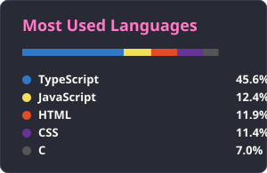

<h1 align="center">
  
</h1>

  

---

### 📊 GitHub Stats & Most Used Languages

  
  &nbsp;&nbsp;
  

  

---

### 🛠️ Primary Tech Stacks

- **Server & Infra** :  
  
  
  

- **Languages & Frameworks** :  
  
  
  
  

- **Version Control & Collaboration** :  
  
  

---
